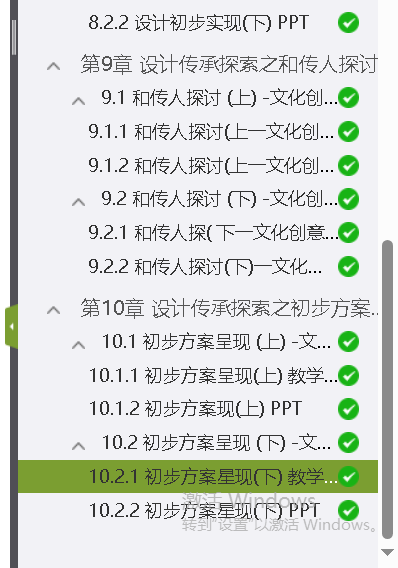

# 学习通自动刷课

## 1. 测试课程：孙亚云 校际联盟 中国传统手工艺与文化创意设计
## 2. 使用工具 autopytoexe
## 3. 使用方法

> conda create --name xxtsk python=3.10

> conda activate xxtsk

> pip install -r requirements.txt -i https://pypi.tuna.tsinghua.edu.cn/simple

> 学习通登录，更换element内元素更换为本机屏幕下截图

> python main.py

> 学习通学习页面全屏，自动刷课

## 4. 无显示器远程后台刷课
使用todesk+显卡欺骗器，安全设置中关闭退出黑屏即可。

## 5. 其他课程能否刷课？
请查看本项目中刷课逻辑，按所需课程微调逻辑。
